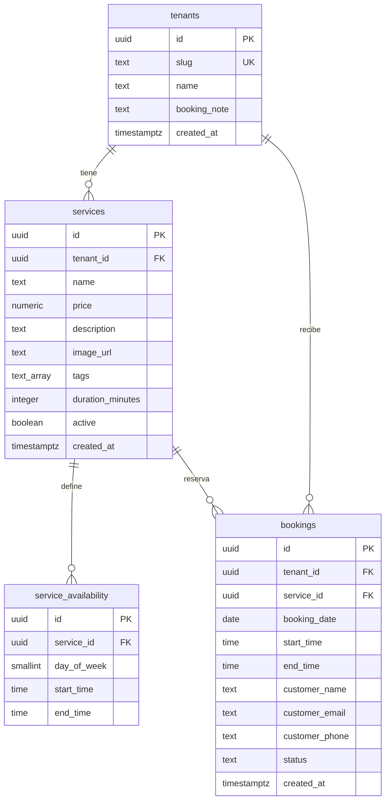

# Fastbook — Roadmap

## Visión

Aplicación **multitenant** de reserva de citas, con plan **gratuito** y **features premium**.

## Fase 0 — Bootstrap (actual)

- [x] Proyecto React + Vite + TypeScript
- [x] Dependencias FE: TanStack Query, React Router, Zustand
- [x] Reglas del agente Cursor (`.cursor/rules/`)
- [x] Vitest + Testing Library (tests unitarios)
- [x] CI: workflow `verify` (lint + tests en push)
- [x] Esquema BBDD capa gratuita aplicado en Supabase (`free_tier_schema`)
- [ ] Enganche con MCP Google Stitch (diseño de pantallas)
- [x] Enganche con MCP Supabase (migración + RLS)

## Fase 1 — MVP de reserva (lo más simple)

Interfaz web que permita:

1. Seleccionar un **servicio**
2. Seleccionar un **día**
3. Seleccionar una **hora**
4. **Apuntarse** a esa cita

Sin paneles avanzados, pagos ni lógica premium todavía. Multitenant desde el modelo de datos (cada negocio/tenant con sus servicios y slots).

## Esquema de datos (capa gratuita)

Modelo pensado para `booked.es/{slug}`: el **tenant** es la empresa; el público lee servicios y disponibilidad; las reservas se escriben de forma controlada (service role / backend).

### Tablas

| Tabla | Qué es |
|---|---|
| `tenants` | Empresa/negocio. `slug` único → URL pública. `booking_note` se muestra antes de confirmar. |
| `services` | Catálogo por tenant. `duration_minutes` calcula huecos; `active` oculta sin borrar. |
| `service_availability` | Ventanas semanales por servicio (`day_of_week` 0=dom…6=sáb + `start_time`/`end_time`). |
| `bookings` | Reserva concreta. Unique `(service_id, booking_date, start_time)` evita dobles. Status: `confirmed` \| `cancelled`. |

### Relaciones y flujo

1. Un **tenant** tiene muchos **services**.
2. Cada **service** define su **availability** semanal.
3. El FE calcula slots libres: availability − bookings confirmadas, usando `duration_minutes`.
4. Al apuntarse se crea un **booking** ligado a tenant + service + fecha/hora + datos del cliente.

### RLS (Row Level Security)

- RLS activado en las 4 tablas.
- Lectura pública: `tenants`, `services` activos, `service_availability`.
- Escritura/lectura de `bookings`: vía backend con **service role** (o auth de dashboard más adelante). Sin policy de insert pública en el MVP.

### SQL de referencia (capa gratuita)

Fuente: [`supabase/migrations/20260927000000_free_tier_schema.sql`](supabase/migrations/20260927000000_free_tier_schema.sql).

**Estado:** aplicado en el proyecto Supabase `fastbook` (`ptgltexbfxjqmyozcavt`) como migración `free_tier_schema`. SQL de referencia en el repo: [`supabase/migrations/20260927000000_free_tier_schema.sql`](supabase/migrations/20260927000000_free_tier_schema.sql).

## Fase 2 — (pendiente de definir)

- Auth y roles (cliente / negocio)
- Gestión de disponibilidad del tenant
- Features premium (por definir)

## Notas

- FE: Stitch → implementación React.
- BE: Supabase (tablas, RLS, clientes).
- Stack FE ya instalado: `@tanstack/react-query`, `react-router-dom`, `zustand`.
- Tests: `pnpm test` (watch) / `pnpm test:run` (CI). Archivos `*.test.ts(x)` / `*.spec.ts(x)` en `src/`.
