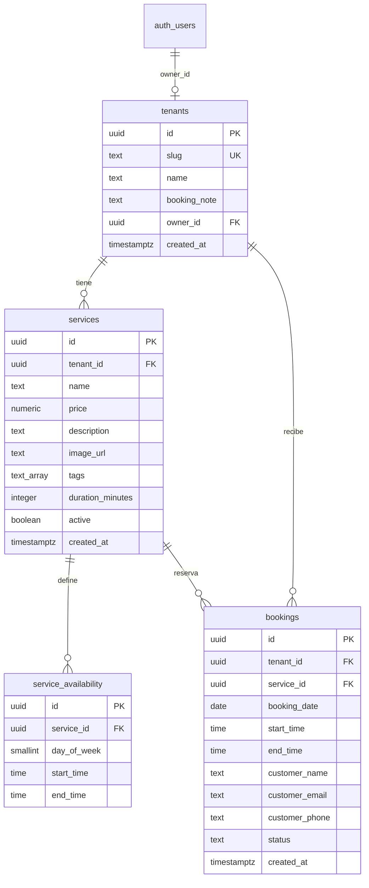

# Fastbook — Roadmap

## Visión

Aplicación **multitenant** de reserva de citas, con plan **gratuito** y **features premium**.

## Fase 0 — Bootstrap

- [x] Proyecto React + Vite + TypeScript (+ React Compiler)
- [x] Dependencias FE: TanStack Query, React Router, Zustand
- [x] Reglas del agente Cursor (`.cursor/rules/`)
- [x] Vitest + Testing Library (tests unitarios)
- [x] CI: workflow `verify` (lint + tests en push)
- [x] Esquema BBDD capa gratuita aplicado en Supabase (`free_tier_schema`)
- [x] Enganche con MCP Google Stitch (diseño de pantallas)
- [x] Enganche con MCP Supabase (migración + RLS)
- [x] Cliente Supabase FE + aliases `@src` / `@components`
- [x] `.env.test` con stubs (CI sin `.env.local`; ver regla tests/Supabase)

## Fase 1 — MVP de reserva pública ✅

Interfaz web en `/:tenantSlug`:

1. Seleccionar un **día**
2. Seleccionar una **hora**
3. Seleccionar un **servicio**
4. **Apuntarse** (datos de contacto + confirmación)

Progreso (PRs `#1` main-page, `#2` customer-form):

- [x] Ruta `/:tenantSlug` con hero + logo + calendario (`components/calendar`)
- [x] Franjas horarias (`components/time-slots`)
- [x] Listado de servicios (seed Supabase + `components/service-list`)
- [x] Formulario de contacto del cliente + confirmación de reserva
- [x] `create-booking` / `get-tenant-by-slug` + policies de insert público de bookings
- [x] Home `/` como entrada (CTA hacia alta/login empresa)

Sin paneles avanzados, pagos ni lógica premium. Multitenant desde el modelo de datos.

## Fase 2 — Auth enterprise (login / alta) ✅ (shell)

PR `#3` (`feat/enterprise-auth-login`). Objetivo cumplido: el negocio se registra o inicia sesión y llega a un **dashboard shell** autenticado.

### BBDD + RLS

- [x] Migración `tenant_auth`: `tenants.owner_id` → `auth.users(id)` (unique parcial)
- [x] Helper `public.is_tenant_owner(tenant_id)` + policies owner (CRUD services / availability / bookings del tenant)
- [x] Migración follow-up helper privado (`tenant_auth_private_helper`)
- [x] Types FE regenerados (`database.types.ts`)

SQL en repo:

- [`supabase/migrations/20260930000000_tenant_auth.sql`](supabase/migrations/20260930000000_tenant_auth.sql)
- [`supabase/migrations/20260930000001_tenant_auth_private_helper.sql`](supabase/migrations/20260930000001_tenant_auth_private_helper.sql)

### Auth FE (Supabase Auth email + password)

- [x] `AuthSessionProvider` + `useAuthSession` + `auth-session` helpers
- [x] Guard `RequireAuth` → redirect a `/enterprise/login`
- [x] `signUpTenant` / `signInTenant` / `ensureOwnedTenant` / `getTenantByOwner`
- [x] Perfil pendiente en `user_metadata` (`business_name`, `business_slug`) si hace falta confirmación de email; creación del tenant en el primer login con sesión
- [x] Validaciones / slugs reservados / errores mapeados (`tenant-auth.utils`)
- [x] `completeBusinessSetup` para alta de negocio cuando el user ya tiene sesión sin tenant

### UI / rutas

| Ruta | Página | Estado |
|---|---|---|
| `/` | Home (CTA a enterprise) | Hecho |
| `/:tenantSlug` | Reserva pública | Hecho |
| `/enterprise/login` | Login + signup (toggle) UI Stitch | Hecho |
| `/enterprise/check-email` | Post-signup: “confirma tu email” | Hecho |
| `/enterprise/:tenantSlug` | Dashboard shell (logout, link a página pública) | Hecho (vacío de features) |

- [x] Pantalla login/signup siguiendo Stitch **Login de Empresas**
- [x] Redirect post-auth a `/enterprise/:tenantSlug`
- [x] Tests unitarios de utils (`tenant-auth.utils`, `ensure-owned-tenant.utils`) sin depender de tokens reales
- [x] Post-signup → `/enterprise/check-email` (no mensaje inline en login)
- [x] `emailRedirectTo` → `/enterprise/login` (sesión post-confirm → auto dashboard; nunca aterrizar en `/`)
- [x] Loading en botón submit (spinner + texto) + bootstrap en login mientras resuelve tenant
- [x] Signup: detectar email ya registrado (`identities: []` ofuscado) + pre-check slug ocupado
- [x] Migración `tenants_owner_delete_cascade`: borrar user Auth → cascade del tenant (evita huérfanos)

**Config Supabase (manual):** en Authentication → URL Configuration, añadir a Redirect URLs:
`http://localhost:5173/enterprise/login` (y la URL de prod equivalente). Sin esto, Supabase ignora `emailRedirectTo` y vuelve al Site URL (`/`).

### Fuera de alcance de esta fase (siguiente)

- [ ] Dashboard real: agenda, citas, gestión de servicios / availability (ref. Stitch **Agenda y Citas**)
- [ ] Flujo de “completar alta de negocio” en UI si `needs_business_setup` (lib ya existe)
- [ ] Miembros / roles multi-usuario por tenant (hoy solo `owner_id`)
- [ ] Recover password / magic link
- [ ] Features premium

## Fase 3 — Dashboard tenant (siguiente)

Punto de partida para el siguiente agente:

1. Cargar en Stitch la pantalla **Agenda y Citas (Dashboard Empresa)** y alinear UI.
2. Listar bookings del tenant autenticado (RLS owner ya permite select).
3. CRUD mínimo de servicios y/o availability desde el panel.
4. Verificar en dashboard de Supabase que Redirect URLs incluye `/enterprise/login` (dev + prod).

## Esquema de datos (capa gratuita + auth)

Modelo pensado para `booked.es/{slug}`: el **tenant** es la empresa; el público lee servicios y disponibilidad; las reservas se escriben con policy controlada; el **owner** gestiona su tenant autenticado.

```mermaid
erDiagram
  auth_users ||--o| tenants : "owner_id"
  tenants ||--o{ services : "tiene"
  tenants ||--o{ bookings : "recibe"
  services ||--o{ service_availability : "define"
  services ||--o{ bookings : "reserva"

  tenants {
    uuid id PK
    text slug UK
    text name
    text booking_note
    uuid owner_id FK
    timestamptz created_at
  }

  services {
    uuid id PK
    uuid tenant_id FK
    text name
    numeric price
    text description
    text image_url
    text_array tags
    integer duration_minutes
    boolean active
    timestamptz created_at
  }

  service_availability {
    uuid id PK
    uuid service_id FK
    smallint day_of_week
    time start_time
    time end_time
  }

  bookings {
    uuid id PK
    uuid tenant_id FK
    uuid service_id FK
    date booking_date
    time start_time
    time end_time
    text customer_name
    text customer_email
    text customer_phone
    text status
    timestamptz created_at
  }
```

### Tablas

| Tabla | Qué es |
|---|---|
| `tenants` | Empresa/negocio. `slug` único → URL pública. `owner_id` → `auth.users`. `booking_note` antes de confirmar. |
| `services` | Catálogo por tenant. `duration_minutes` calcula huecos; `active` oculta sin borrar. |
| `service_availability` | Ventanas semanales por servicio (`day_of_week` 0=dom…6=sáb + `start_time`/`end_time`). |
| `bookings` | Reserva concreta. Unique `(service_id, booking_date, start_time)` evita dobles. Status: `confirmed` \| `cancelled`. |

### Relaciones y flujo

1. Un **tenant** tiene muchos **services** y un **owner** (`owner_id`).
2. Cada **service** define su **availability** semanal.
3. El FE público calcula slots libres: availability − bookings confirmadas, usando `duration_minutes`.
4. Al apuntarse se crea un **booking** ligado a tenant + service + fecha/hora + datos del cliente.
5. Alta empresa: `signUp` → (opcional confirm email) → `ensureOwnedTenant` inserta fila en `tenants` con `owner_id`.

### RLS (Row Level Security)

- RLS activado en las 4 tablas.
- Lectura pública: `tenants`, `services` activos, `service_availability`.
- Insert público de `bookings` (policies de booking público; ver migraciones `20260928*`).
- Owner autenticado: CRUD de services / availability / bookings de su tenant vía `is_tenant_owner`.

### SQL de referencia

| Migración | Qué |
|---|---|
| [`20260927000000_free_tier_schema.sql`](supabase/migrations/20260927000000_free_tier_schema.sql) | Esquema base + RLS lectura pública |
| [`20260928000000_public_booking_insert.sql`](supabase/migrations/20260928000000_public_booking_insert.sql) | Insert público bookings |
| [`20260928000001_fix_bookings_insert_tenant_check.sql`](supabase/migrations/20260928000001_fix_bookings_insert_tenant_check.sql) | Check tenant en insert |
| [`20260930000000_tenant_auth.sql`](supabase/migrations/20260930000000_tenant_auth.sql) | `owner_id` + RLS owner |
| [`20260930000001_tenant_auth_private_helper.sql`](supabase/migrations/20260930000001_tenant_auth_private_helper.sql) | Helper privado follow-up |

**Proyecto Supabase:** `fastbook` (`ptgltexbfxjqmyozcavt`, `eu-west-1`).

## Notas

- FE: Stitch → implementación React.
- BE: Supabase (tablas, RLS, Auth, clientes).
- Stack FE: `@tanstack/react-query`, `react-router-dom`, `zustand`, `react-hook-form` (enterprise login), `classnames`.
- Tests: `pnpm test` (watch) / `pnpm test:run` (CI). Archivos `*.test.ts(x)` / `*.spec.ts(x)` en `src/`.
- Tras cada feature larga: actualizar **este archivo** (hecho / pendiente / siguiente) para el siguiente agente.
